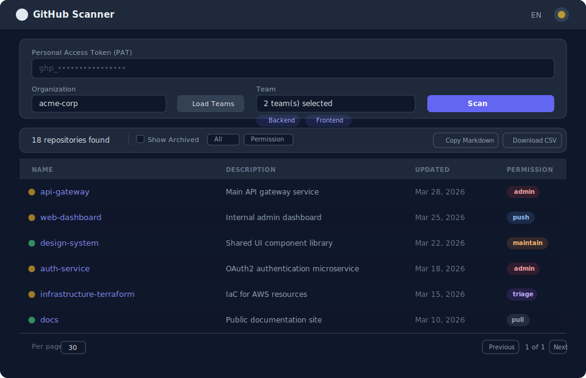

# GitHub Scanner

A client-side web tool that lists active repositories from GitHub Organization teams.

## Why?

GitHub doesn't show which repos a child team owns directly vs. inherits from its parent.
GitHub Scanner detects inherited access by comparing parent/child team permissions, so you can filter down to only the repos your team actually manages.

## Features

- **Inheritance detection** -- distinguishes direct vs. inherited team repo access (not available in GitHub UI)
- Scan by team, user, or both -- results merged and deduplicated
- Multi-team and multi-user selection
- Filter by visibility, permission level, archived status, and inheritance
- Column sorting by name, last updated, and permission level
- Export filtered results to Markdown (with links) or CSV
- Dark mode with system preference detection and manual toggle
- Internationalization: English and Korean
- Client-side pagination (10 / 30 / 50 rows per page)
- No backend -- runs entirely in the browser

## Screenshot



## Getting Started

No build step required. Clone and run locally:

```bash
git clone https://github.com/Bigide19/github-scanner.git
cd github-scanner
```

Then serve with any static file server:

```bash
# Using Node.js
npx serve .

# Using Python
python3 -m http.server

# Using PHP
php -S localhost:8000
```

Open `http://localhost:3000` (serve) or `http://localhost:8000` (python/php) in your browser.

Or just visit the live version at **https://bigide19.github.io/github-scanner/**

## Usage

1. Enter your GitHub Personal Access Token.
2. Enter the organization name and click **Load Teams**.
3. Select one or more teams from the list.
4. Click **Scan** to fetch repositories.
5. Filter, sort, or export the results as needed.

## PAT Scopes

| Scope      | Purpose                                              |
|------------|------------------------------------------------------|
| `read:org` | Access team and organization information              |
| `repo`     | Access private repositories (optional for public-only)|

Generate a token at **GitHub > Settings > Developer settings > Personal access tokens**.

## Security

- No backend -- all logic runs entirely in the browser.
- No tracking -- no analytics, telemetry, or third-party calls.
- Session only -- your PAT is stored in `sessionStorage` and cleared when the tab closes.
- API calls are made exclusively to `api.github.com`.

## Tech Stack

- HTML5
- [Tailwind CSS](https://tailwindcss.com/) (CDN)
- Vanilla JavaScript

No build tools, no bundler, no framework.

## License

[MIT](LICENSE)
